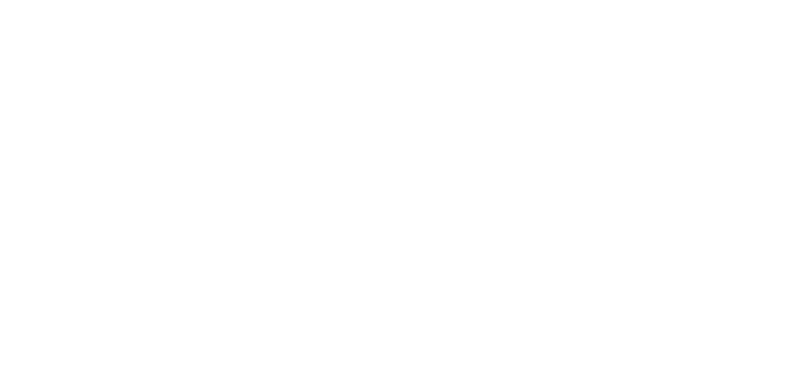

<br>

# 😁 Olá, me chamo Mateus

<br>


## 👥 Me Encontre

Use o tema escuro para ver minhas redes sociais 😉

<br>

<a href="https://linkedin.com/in/mateus-ito"></a>
<a href="https://codepen.io/mateus-ito"></a>
<a href="https://instagram.com/mateus_ito_silva/"></a>

<br>
<br>

## 👩🏻‍💻 Sobre Mim 

<br>

📖 | Sempre aberto a novas tecnologias, para crescer em conhecimento \
🎓 | Estudante de [JavaScript](https://developer.mozilla.org/pt-BR/docs/Learn/JavaScript), Web Design, Marketing Digital \
🎵 | Músico nas horas vagas 🎸🎹🎤\
💬 | Inglês técnico, estudando para alcançar a fluência

<br>
<br>

## 🌐 Linguagens e Tecnologias

<br>

```javascript
const me = new Developer({
    name: 'Mateus Ito',
    skills: {
        frontEnd: {
            UI: ['Vue', 'Vuex', 'Nuxt', 'JavaScript'],
            css: ['Tailwind', 'Bootstrap', 'Vuetify', 'SCSS']
        },
        backEnd: {
            dataBase: ['Firebase'],
            deploy: ['Vercel', 'Netlify']
        }
    }
})
```

<br>
<br>

## ⚙ Analytics

<br>

<p align="center">
    <a href="https://github.com/jos620">
        
        
    </a>
</p>
